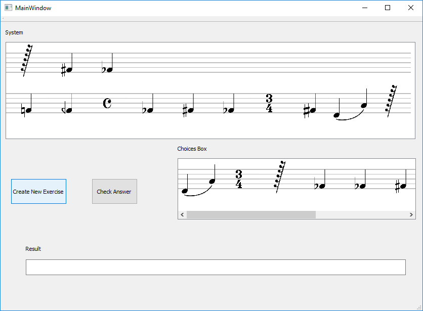

# Musicology Application

In this repository you will find an application for exercising in Counterpoint. A **Counterpoint System** consists of two pentagrams, where the lower pentagram is filled with a Sequence of Musical Notes and the upper pentagram is empty. The musicologist-user has to fill the upper pentagram with the right Musical Notes according to musicological rules.

**Note!** Currently, the rules are imaginary so you can see a demo of the app to check the workflow.

Go to [/musicology](/musicology) for more details